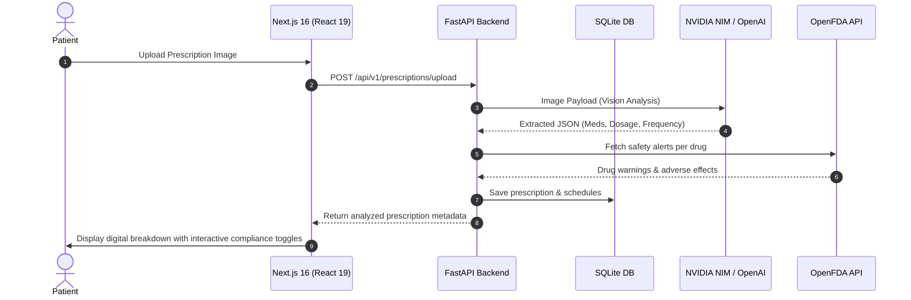

# 🩺 Prescripto AI — Intelligent Prescription & Medication Assistant

[](https://fastapi.tiangolo.com/)
[](https://nextjs.org/)
[](https://www.typescriptlang.org/)
[](https://www.sqlite.org/)
[](https://build.nvidia.com/)
[](https://tailwindcss.com/)

Prescripto AI is a state-of-the-art, premium medical assistant application. It allows users to scan paper prescriptions using advanced AI computer vision, automatically extracts prescribed medications with precise dosages and warnings, performs safety cross-checks against the official **OpenFDA database**, tracks daily compliance streaks in a gorgeous interactive tracker, and features a real-time conversational AI health assistant.

---

## 📸 Desktop & Mobile Preview

The application features a sleek glassmorphic dashboard optimized for both desktop view and responsive Progressive Web App (PWA) installation on iOS and Android devices.

*Sleek interactive medicine compliance tracker, AI assistant conversation panel, and dynamic health stats.*

---

## ⚡ Key Features

1. **📷 AI Prescription OCR Scanner**
   - Upload any image of a handwritten or printed prescription.
   - Leverages NVIDIA NIM/OpenAI vision models to extract drug names, dosages, frequencies, and specific intake notes.
2. **⚠️ OpenFDA Safety Checks**
   - Automatically cross-references extracted medications with the OpenFDA API to flag potential adverse reactions, drug-to-drug interactions, and safety alerts.
3. **📅 Intelligent Compliance Tracker**
   - High-fidelity daily dashboard featuring morning/afternoon/evening schedules.
   - One-click actions to mark medicines as **Taken** or **Missed** with real-time gamified streak counters.
4. **💬 Conversational AI Health Assistant**
   - Sandbox chat terminal powered by LLM models for context-aware queries about prescription info, side effects, and health guides.
5. **🔒 Secure Session Authentication**
   - Secure sign-up, login, and profile tracking using JWT access tokens.
6. **📱 Progressive Web App (PWA)**
   - Installed seamlessly on iOS Safari and Android Chrome as a native app with customized startup icons.

---

## 📐 System Architecture



---

## 🚀 Local Installation & Setup

Ensure you have **Python 3.10+** and **Node.js 18+** installed on your system.

### 1. Backend Configuration

Navigate into the backend folder, initialize the virtual environment, and install dependencies:

```bash
# Go to backend directory
cd backend

# Create virtual environment
python -m venv venv

# Activate virtual environment (Windows PowerShell)
.\venv\Scripts\Activate.ps1

# Install requirements
pip install -r requirements.txt
```

Create a `.env` file in the `backend/` directory using the template below:

```ini
# Database Configuration
DATABASE_URL=sqlite:///./sql_app.db

# Authentication Secret
JWT_SECRET=prescripto-ai-jwt-secret-key-2026-change-in-production

# AI Services (NVIDIA NIM or OpenAI Key)
OPENAI_API_KEY=your_nvidia_nim_or_openai_api_key_here

# Frontend CORS Origin URL
FRONTEND_URL=http://localhost:3000
```

Start the FastAPI application server:

```bash
uvicorn app.main:app --host 127.0.0.1 --port 8000 --reload
```

The API docs will be live at `http://127.0.0.1:8000/docs`.

---

### 2. Frontend Configuration

Navigate into the frontend folder and install standard dependencies:

```bash
# Go to frontend directory
cd ../frontend

# Install node packages
npm install
```

Start the Next.js development server:

```bash
npm run dev
```

Open [http://localhost:3000](http://localhost:3000) in your browser to view the application.

---

## 🛡️ Production Deployment

### Backend (Render / Heroku)
- Runtime: `Python 3`
- Build Command: `pip install -r requirements.txt`
- Start Command: `uvicorn app.main:app --host 0.0.0.0 --port $PORT`
- Configure your production `.env` variables under Render/Heroku Dashboard Settings.

### Frontend (Vercel)
- Vercel automatically detects the Next.js workspace.
- Configure environment variable: `NEXT_PUBLIC_API_URL` pointing to your deployed backend URL.

---

## 📄 License
This project is licensed under the MIT License. Feel free to use and extend it!
