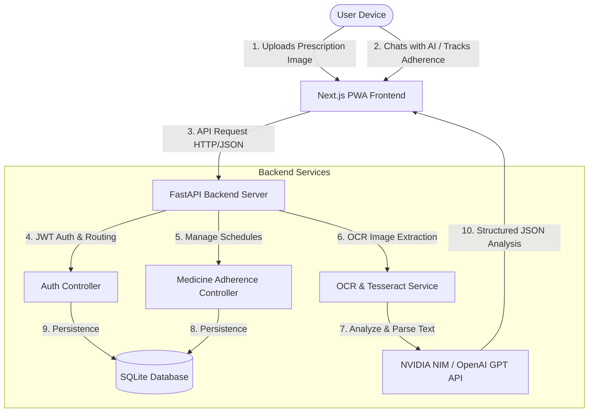

# 🩺 Prescripto AI — Intelligent Medical Assistant & Prescription Tracker

[](https://fastapi.tiangolo.com/)
[](https://nextjs.org/)
[](https://react.dev/)
[](https://www.typescriptlang.org/)
[](https://tailwindcss.com/)
[](https://www.sqlite.org/)
[](https://build.nvidia.com/)

**Prescripto AI** is a state-of-the-art medical companion application that enables users to scan handwritten or printed prescriptions via AI OCR, extract structured dosage schedules, track medication adherence with streak analytics, and converse with a specialized medical AI assistant. 

Designed with a **sleek dark glassmorphism theme**, **smooth micro-animations**, and full **PWA (Progressive Web App)** capabilities, Prescripto AI is built to provide an elevated and accessible health experience on desktop and mobile alike.

---

## 🗺️ System Architecture



---

## ✨ Premium Features

*   **📷 Intelligent Prescription Scanner**: Upload your prescription photo. The system runs local/cloud OCR extraction combined with advanced LLM parsing to instantly pull medicines, exact strengths, dosages, frequency, and custom guidelines.
*   **📅 Daily Medication Tracker**: A morning, afternoon, and evening medicine schedule dynamically grouped for patient clarity. Easily check off doses as **Taken** or **Missed**.
*   **🔥 Adherence Analytics & Streaks**: Visualize your medicine streaks with dynamic visual badges and automatic compliance tracking to encourage consistent health habits.
*   **💬 Integrated AI Health Advisor**: Chat with a specialized medical AI helper built to address potential drug-to-drug interactions, side effects, and correct administration procedures.
*   **📱 Progressive Web App (PWA)**: Optimized for mobile. Add the app to your Home Screen on iOS or Android for a standalone, premium app feel.

---

## 🚀 Quick Start Guide

### 1. Prerequisites
- **Python 3.10+** installed on your system.
- **Node.js 18+** and `npm` installed.

---

### 2. Backend Setup

1. Navigate to the backend directory:
   ```bash
   cd backend
   ```

2. Create and activate a virtual environment:
   - **Windows (PowerShell)**:
     ```powershell
     python -m venv venv
     .\venv\Scripts\Activate.ps1
     ```
   - **macOS/Linux**:
     ```bash
     python3 -m venv venv
     source venv/bin/activate
     ```

3. Install dependencies:
   ```bash
   pip install -r requirements.txt
   ```

4. Configure environment variables in `.env` (copy and edit from `.env.example`):
   ```env
   DATABASE_URL=sqlite:///./sql_app.db
   JWT_SECRET=your_jwt_secret_key_here
   OPENAI_API_KEY=your_nvidia_nim_or_openai_key
   FRONTEND_URL=http://localhost:3000
   ```

5. Run database migrations:
   ```bash
   python migrate_db.py
   ```

6. Start the FastAPI development server:
   ```bash
   python -m uvicorn app.main:app --host 127.0.0.1 --port 8000
   ```

---

### 3. Frontend Setup

1. Navigate to the frontend directory:
   ```bash
   cd ../frontend
   ```

2. Install the frontend node packages:
   ```bash
   npm install
   ```

3. Launch the Next.js development server:
   ```bash
   npm run dev
   ```

4. Open **[http://localhost:3000](http://localhost:3000)** in your browser to view the application!

---

## 🔒 Environment Variable Configuration

### Backend Env Variables (`backend/.env`)
| Variable | Description |
|---|---|
| `DATABASE_URL` | Connection string for SQLite database (e.g., `sqlite:///./sql_app.db`) |
| `JWT_SECRET` | Secret key used to encrypt and verify user sessions |
| `OPENAI_API_KEY` | NVIDIA NIM or OpenAI API Key to power the OCR analysis and AI Chat advisor |
| `FRONTEND_URL` | Address of the frontend client for secure CORS setup (defaults to `http://localhost:3000`) |

---

## 🛠️ Technology Stack Detail

- **Frontend**: Next.js 16 (Turbopack), React 19, TypeScript, Tailwind CSS, Lucide icons, Framer Motion, Recharts.
- **Backend**: FastAPI, SQL Alchemy ORM, Pydantic, Python-Jose (JWT), SQLite, Tesseract OCR / LLM Engine.
- **AI Integrations**: Llama-3-70b-instruct/GPT-4o, structured JSON schema outputs.

---

## 📄 License & Compliance
This software is intended for educational and personal assistance purposes only. All clinical data, dosage extractions, and AI chat answers should be cross-referenced with licensed healthcare professionals.
